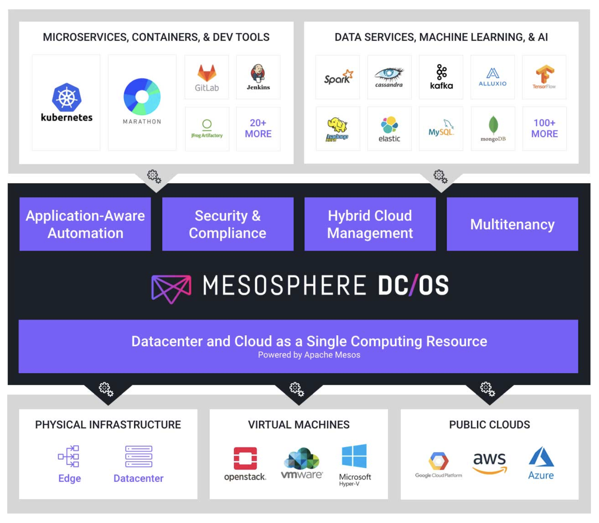
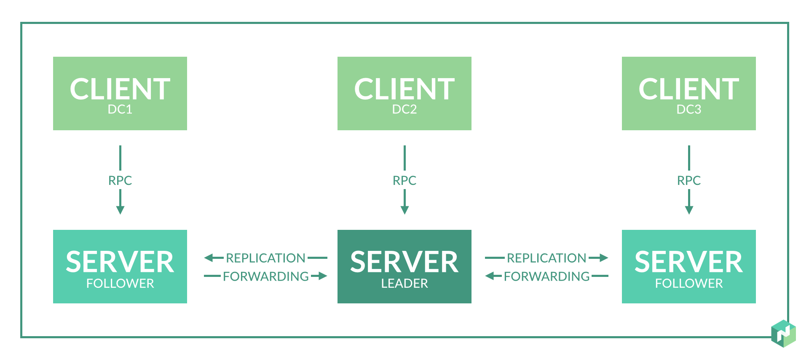

# Evolution of container orchestration platforms

## Mesos & DCOS from Mesosphere

- Apache Mesos is a basic resource allocator, develoepd at Berkeley labs
- It allows you to run tasks across a set of distributed nodes and mesos does the resource allocation and scheduling of "tasks"
- To run containers on top of Mesos, you can use a framework called "Marathon"
- Similarly it provides frameworks for running Kafka, Elastic, Kubernetes and so on
- A lot of bigdata workloads run on Mesos
- Mesosphere is the company which has a offering called DCOS - Data Center Operating system which uses Mesos, Martathon and other frameworks and provides commercial support.

Image source: https://mesosphere.com

## Docker Swarm

- Docker engine can be run in Swarm mode - across machines
- Very similar experience like Docker CLI
- Networking is very different as compared to Kubernetes

Image source: https://www.docker.com/

## Nomad

- Nomad supports containers as well as other kind of workloads 
- Nomad is focused on relatively lesses functionality - but robust on what it does. 
- It is one of simplest orchestrators and is a good fit if it can satisfy your needs
- Only focuses on cluster management and scheduling

Source: https://www.nomadproject.io/docs/internals/architecture.html

## AWS ECS

- AWS ECS is a commercial container orchestrator - which basically schedules containers (called as tasks) on nodes and exposes services

Source: https://docs.aws.amazon.com/AmazonECS/latest/developerguide/Welcome.html