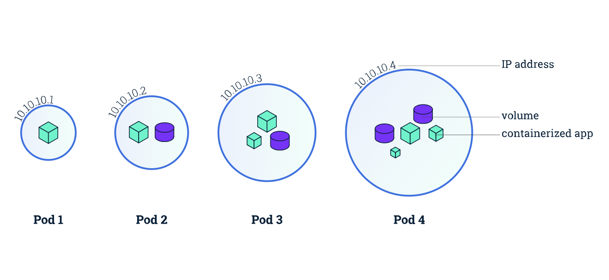

# Pod

# What is a pod

- The most basic building block in Kubernetes objects/resources.

- Set of containers running together - which share port space, network and storage

- Most common pattern is of single container in pod, but Kubernetes manages pod and that in turn manages container

Source https://kubernetes.io/docs

- Pods are ephemeral - they can die anytime!

- So how do you make sure that even if pods die, things work?