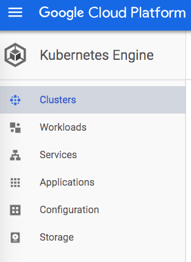
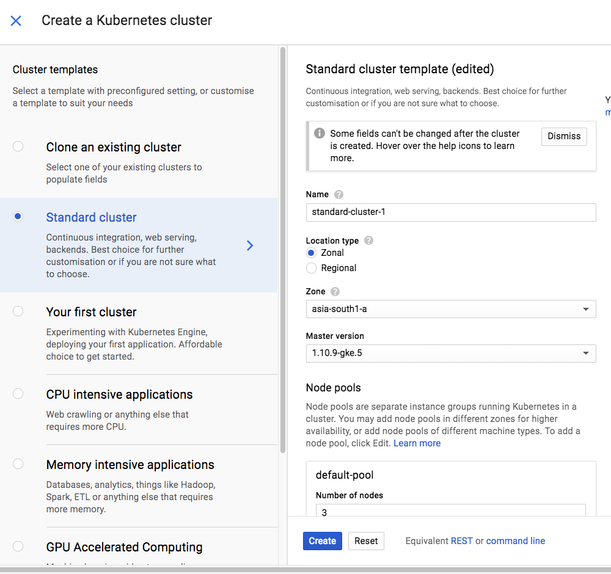

# Setting up Kubernetes

Use one of the following as a Kubernetes cluster. 

1) Docker for Desktop with Kubernetes enabled
2) Minikube
3) Sign up for free Google Cloud account and get credits worth 300$. This should enable you to create a Kubernetes cluster using GKE and use that for hands on

## Install Kubernetes

### Minikube

#### macOS
```shell
brew cask install minikube
```

#### Linux

```shell
curl -LO https://storage.googleapis.com/minikube/releases/latest/minikube-linux-amd64 \
  && sudo install minikube-linux-amd64 /usr/local/bin/minikube
```

### Docker for Desktop

Go to preferences & enable Kubernetes

### GKE

Go to Kubernetes Engine section in Google Cloud console






### Install Kubectl

[Kubectl installation](https://kubernetes.io/docs/tasks/tools/install-kubectl)

